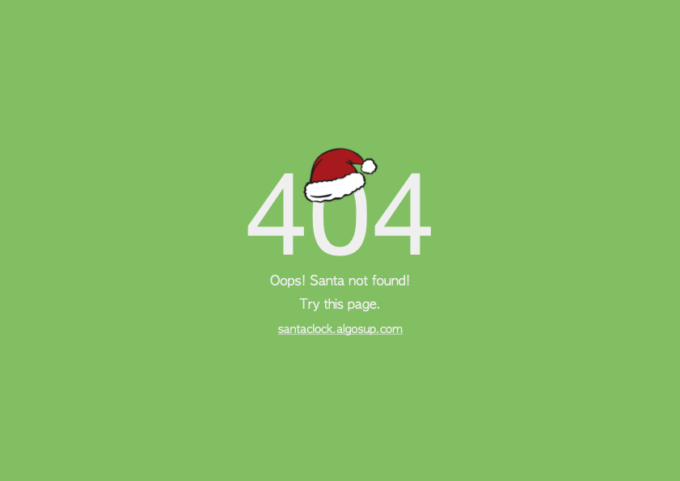

 santaclock.algosup.com 

 Functional Specification

 

 Clémentine Curel

 

 ALGOSUP, Group 6. All Rights Reserved. 

# Summary

Table of content

    
- [Summary](#summary)
- [Overview](#overview)
- [Stakeholders](#stakeholders)
- [Personas](#personas)
- [Scenarios](#scenarios)
- [Fonctionalities](#fonctionalities)
   - [Non-goals](#non-goals)
   - [Design](#design)
   - [Mockups](#system-interface)
      - [index.html](#indexhtml)
      - [404.html](#404html)
- [Details](#details)
- [Security](#security)
- [Promotion campaign](#promotion-campaign)
   - [Social media](#social-media)
   - [Word-of-mouth](#word-of-mounth)
   - [Customer experience feedback](#customer-experience-feedback)
- [Risks and assumptions](#risk-and-assumptions)
- [Footnotes](#footnotes)

 

# Overview

 

We have just entered the Christmas period, cities have started to decorate their streets, and children have begun to make their gifts list for Santa Claus.

For the eager children out there, we want a website where all the children in the world can see exactly when Santa will come[^santa].

The first objective of this project is to ensure a peak load[^peak] of the website at every time. We want to be sure that a maximum of users can go on this website simultaneously.

The second objective of this project is to give the user a fixed time in the time zone of the address.

The third objective of this project is to promote the website to find users.

These three objectives have to be realised with Docker.

Multiple people have already created websites or applications that can do that. These take your location and the time till Christmas.
We want something more precise but also not restricted to your position.

 

The project is due on the 15th of December 2022.

 

# Stakeholders

- ALGOSUP
- Users

 

# Personas

 

 

# Scenarios

 

**Scenario 1: Mike.**

Mike is a child of 6 years old who is impatient about Christmas and receiving gifts. Especially the last fire truck toy. With all this impatience, his mother has given him her tablet so he can know when Santa will come. Her mom has heard about the website santaclock thanks to one of her friends.

Mike is worried about being alone on this website because he has difficulties in reading and writing. The biggest problem is not finding the place he wants.

 

**Scenario 2: Camille.**

From the height of her ten years, Camille wants to meet Santa Claus at all costs. To meet him, she has decided that this year, she will hide and wait patiently for his arrival. To not miss his arrival, she's hiding with her parents' tablet on the santaclock website and constantly refreshes it.

 

**Scenario 3: Irène.**

Irène is a mom of two kids who constantly ask her when Santa will arrive. To take some rest of those questions, she has decided to leave them on the santaclock website.

As a protective mom, she wants to be sure her children are safe on this website. That is why she doesn't want to be asking for pieces of information or seeing ads.

 

**Scenario 4: Carl.**

Carl is a computer science student who searching for a school. To find an interesting school he's going on multiple tradeshows. This is where he discovered ALGOSUP[^algosup], some of their students have created the santaclock website.

Wanting to know what level of skill is taught at ALGOSUP, Carl decides to test how many requests the website can handle.

 

**Scenario 5: Mike.**

The little Mike we saw previously will spend his Christmas at her aunt's house in New Zealand. Between Australia and New Zealand, there is one hour of difference. So Mike decides to write his aunt's address on the santaclock website.

 

# Fonctionalities

We have decided to implement a countdown because it avoids the constant refresh of the user to know the exact time.

It's a countdown[^countdown] till midnight on the 24th of December. In order to do this, the user only needs to write a postal address[^postal]. Then, we will convert this address into geographic coordinates[^coordinates] to know when it's midnight following the sun and not the clock.

The countdown[^countdown] will display the number of days, hours, minutes and seconds left before the precise time when the sun will be at the exact opposite of these coordinates on the 24th of December 2022.

We use the position of the sun instead of the clock because we assume that Santa travels at the speed of the sun[^speed].

 

The project is a website because we need it to be fast. We don't want the users to lose their time by downloading an application.

We want to use [Docker](https://www.docker.com/)[^docker] to develop the website and make the deployment easier.

 

When the user arrives on the website, he's on the main page (index.html).
Here, he will get to know the page with the instructions for the address and the countdown[^countdown].

Now that he knows the principal features of the page, he will enter a postal address[^postal] in the right place because it's indicated with a placeholder[^placeholder] with what he has to write.

The placeholder and the address have to be centred on the input[input].

 

The user will have to write:
- A town,
- The postal code of the town,
- The country of this town.

We have decided that the user will not have to write his all address because, in most cases, people don't want to write their address on an unknown website. Additionally, the database will be lighter, so the website will be faster. 

 

A Santa Claus head will be placed at the north pole when there is no address. Once there is a valid address, the Santa head will be at this one.

The website has to be responsive[^responsive] to be multi-screen friendly.

## Non-Goals

 

- Save the input
- Autocompletion of the input
- Other dates

 

## Design

 

The main audience of this website will be kids and their parents. So, this website has to be as much user-friendly as possible.

For the design, we want a Christmas spirit, and for that, we want to use these colours:

- Light green: #58BD59,
- Dark green: #32794B,
- White: #E9E9E9,
- Red: #E82923

The police font will be [Montserrat](https://fonts.google.com/specimen/Montserrat).

The favicon[^favicon] of the website will be this image.

 

## Mockups

Christmas is one of the favourite celebrations for everyone, so we need to compete with a lot of websites like [Santa Tracker](https://santatracker.google.com/), [Xmas Clock](https://www.xmasclock.com/) or [Email Santa](https://www.emailsanta.com/clock.asp) while not copying them.

### index.html

The search button will be larger when hovering it.
 

 

The page when the user writes a wrong address.

 

 

### 404.html

 

 

# Details

 

We will have a subdomain owned by ALGOSUP[^algosup] named santaclock.  

The main aim of this project is to ensure that the website can handle several thousand requests simultaneously.

 

- When the user writes the wrong address, an incomplete address or one with an error, the sentence "Are you sure you have written an existing address?" will appear under the input[^input].

- When the user valid the address, the address will stay in the input[^input]. Therefore, it will be easier for the user to correct his error or to remember the address he writes.

- The user will be able to press a button next to the input[^input] or to press the enter key to validate his address.

- When the user writes the wrong HTTP address on the search bar, he will find an error 404 page[^404].

- The website will have a translation into English and French.

- We will not ask the user for his location. We also don't want any dependencies on anything. It means no Application Programming Interface (API)[^api].

- We want you to find the position of the address by finding the geographical coordinates[^coordinates].

 

We have decided that is pointless to use cookies[^cookies] because:
- We don't ask for login,
- We don't save any information.

 

For a website, the recerencing[^referencing] is one of the principal keys to be found by users. 

Not having a lot of financial means, we have decided not to use so-called paid or sponsored referencing (SEA) but to use so-called natural or organic referencing (SEO). 

 

We don't want to use the time to know when Santa will be there. We want you to use the position of the sun. We assume Santa Claus travels at the speed of the sun[^speed].

So, Santa will arrive when the sun is in the exact opposite position of the address.

Greenwich, UK, will be the first place where Santa will come.

 

# Security

We don't want to save any data.

We need to be sure people can't modify our database or inject some SQL[^inject] in our input[^input].

 

# Promotion campaign

The promotion campaign is the most important thing for a website to have users.  
Correspondingly to this fact, we have opted for three different strategies:

## Social media:

There are over two billion active users on Facebook, over a billion on Instagram and 12 million on Linkedin. Social media are nowadays the best place to promote something. 

Consequently, sharing our website on these platforms is a solution to attract users. 

## Word-of-mouth :

One of the easiest marketing strategies is word-of-mouth. For this strategy, you need to talk about the website with your relatives. 

## Customer experience feedback:

For the rest of the people who don't like the website, to avoid them spreading their unfavourable opinion, we can propose a way to give us feedback. 

We have created an email account (santaclock25@gmail.com) to receive all the feedback.

This feedback will show us what's going wrong on our website. People will also know they we are listening to them.

## Flyer advertise:

Our targets are parents and children, so we have decided to advertise flyers around schools and supermarkets. These flyers will be in French. We also decided to advertise flyers in the ALGOSUP school, with English ones.

To be able to advertise flyers, we need to follow some rules:
- Printed by us
- Do not litter
- No black writing on white background
- No flags

### English flyer

### French flyer 

 

# Risk and assumptions

Doing this type of project, we can have multiple problems like:

- Low user satisfaction => Make it user-friendly.
- Low customer satisfaction or unpredictable requirements changes => Be sure of what the customer wants by making him validate the functional specification.
- Not working software, calculation errors or security issues => Write a test plan and test everything.
- Delay => Follow the forecast planning and respect deadlines.
- Law => Follow precisely the law.
- Go on the wrong website => Use a QR code, good website referencing 
- Don't have enough users => Do a lot of communication about the website.

 

# Footnotes

[^peak]: Several thousands of requests per minute.

[^postal]: The postal address is an address with the postal code and the country.

[^countdown]: DD:HH:MM:SS as days, hours, minutes and seconds.

[^docker]: Docker is a set of platform-as-a-service products that use OS-level virtualization to deliver software in packages called containers.

[^santa]: Between the 24th of december and the 25th of december at midnight.

[^coordinates]: The geographic coordinates of a position are the latitude and longitude in decimal.

[^speed]: The speed of the sun is 850 000 km/h.

[^algosup]: ALGOSUP is a computer science school based in Vierzon. And also the client of this project.

[^placeholder]: A placeholder represents the substitution text for an element.

[^input]: An input is a place where we can write on a web page.

[^404]: A 404 error is an HTTP error code transmitted by a web server when a requested resource is unavailable or the server cannot find it.

[^cookies]: Cookies have multiple uses: they can be used to memorize your customer identifier with a merchant site, the current content of your shopping cart, the display language of the web page, an identifier allowing you to trace your browsing statistical or advertising purposes, etc.

[^API]: It is a set of definitions and protocols for building and integrating application software.

[^favicon]: A favicon is a small 16×16 pixel icon that serves as branding for your website.

[^inject]: SQL injection (SQLi) is a web security vulnerability that allows an attacker to interfere with the queries that an application makes to its database.

[^responsive]: A responsive web design is an approach to web design that aims to make web pages render well on a variety of devices and window or screen sizes from minimum to maximum display size to ensure usability and satisfaction.

[^referencing]: On the internet, the term referencing has been used to define the action of registering a site on a search engine or a directory.
