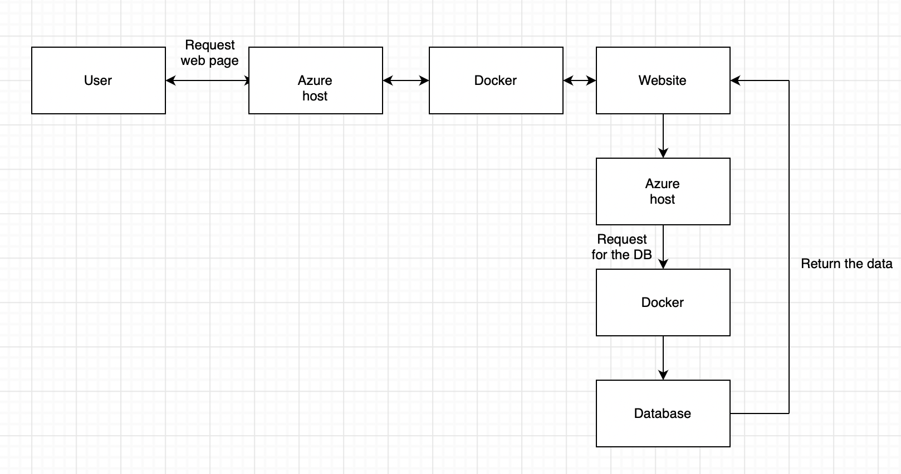

# Santa Clock

## Technical Specification

written by: Théo Diancourt 

<details>
<summary>Table of Contents</summary>

- [Santa Clock](#santa-clock)
  - [Technical Specification](#technical-specification)
    - [Overview](#overview)
      - [Why this project?](#why-this-project)
      - [Schedule](#schedule)
    - [Software](#software)
      - [Software architecture](#software-architecture)
    - [Risks and Assumptions](#risks-and-assumptions)
    - [Testing](#testing)
      - [Stress testing](#stress-testing)
    - [Deployment](#deployment)
      - [Azure](#azure)
          - [Why this hardware?](#why-this-hardware)
      - [Kubernetes](#kubernetes)
      - [Docker](#docker)
    - [Monitoring](#monitoring)
      - [Prometheus](#prometheus)
    - [Website](#website)
      - [Frontend](#frontend)
      - [Backend](#backend)
      - [Database](#database)
    - [Possible improvements](#possible-improvements)
    - [Footnotes](#footnotes)

</details>

### Overview

The goal of the project is to make a prediction of Santa's location based on the current time and the solar time (the exact position of the sun) of the user. The project will be implemented by using these 3 main technologies:
- Node (JavaScript)
- Docker (Containerization)
- Kubernetes (Orchestration)

The project will be accessible through this [website](https://santaclock.algosup.com).

This is a simple project that allow us to focus on the deployment part and the peak load management of the site.

#### Why this project?

The project is a way to learn about the technologies listed above. It is also a good way to know when Santa will precisely come to your house.

The project need to be entirely finished by the 15th of December 2022 but we are going to deploy it before because we want to test the peak load before Christmas.

#### Schedule

The project will be developed in 3 phases:
- Phase 1: The server will be setup, we should only have to finish the website and put everything in a docker container (week 2)

- Phase 2: The project will be deployed on a Kubernetes cluster. then hosted on a server. The server will receive the firsts requests from the users. (Week 3)

- Phase 3: The project will be in a production state. The cluster will be able to handle more requests. The server will be optimised and The project will be ready to be fully used by the users. (Week 5)

### Software

The software will be implemented by using Node, packaged in a Docker container, deployed to a Kubernetes cluster and hosted on a azure server.  

#### Software architecture 

The software will be composed of 3 main parts:
- The website
- The server
- The database

The request will be sent from the website to the server. The server will then send a request to the database to get the data. The server will then send the data to the website as shown in the following diagram: 



### Risks and Assumptions

There is a risk about giving the wrong location of Santa. Or to give the good location but at the wrong time. 

There is another problem about the timestamp. The timestamp will not be based on the time zone of the user. It will be based on the position of the sun so depending on where the user is, the exact moment when Santa will come will be different even if 2 users are in the same time zone.

There is a risk about the peak load of the software. Since will probably not be able to change the server where the software will run, we need to be sure that there will be enough resources to handle the peak load and also check what is the peak load.

We should absolutely handle the possible SQL injections and the possible XSS attacks to avoid any problem with the security of the application, we are going to restrain the user's input to avoid any problem. If someone is able to put a DROP TABLE in the input, the database will be deleted.

### Testing

The software will be tested using the following technologies:
- Mocha (unit testing)
<!-- - Postman (API testing) -->

We are going to test the peak load of the server with 2 different approaches:
- Load testing multiples users at the same time with JMeter
- Load testing complex operations to simulate numerous users

#### Stress testing 

Since we are going to use azure, we can use the built-in stress testing tool to test the peak load of the server. We can also use the built-in monitoring tool to see the CPU usage and the RAM usage of the server at the same time and adapt the server to support a bigger peak load. 

### Deployment

This project need to be deployed with docker also we want to have as many users as possible so we will use Kubernetes to deploy the application in the most efficient way.

The website will be hosted on an Azure Server.

#### Azure 

We have chosen to use the azure container service to deploy our application. It is a managed Kubernetes service that will allow us to deploy our application in a very efficient way, without having to manage the cluster.

The server will be hosted in France.

The image of the application will be automatically deployed on azure when we push on the docker hub.

We also prepared a regular virtual machine to deploy the application in order to have more control over the server and a better understanding of the deployment process.

For this we have chosen to use a regular Virtual Machine with Ubuntu 20.04 LTS.

The server will be hosted in France.

The specifications of the server are up to be changed at any point if the need were to arise but currently we are using:
- 2 vCPU
- 8 GB RAM
- 50 GB SSD

###### Why this hardware? 

| Hardware | Pros | Cons |
| :---: | :---: | :---: |
| Azure Kubernetes Service | - Easy to use <br> - Easy to scale <br> - Easy to manage | - Expensive <br> - Limited control over the server |
| Physical Server | - Easy to manage <br> - Easy to scale <br> - Cheap | - Hard to use <br> - Hard to scale <br> - Hard to manage |

We have chosen to use the minimum requirements for the server because we are going to adapt it depending on the peak load of the server. 

We chose to use ubuntu 20.04 as the operating system, it is the most recent LTS version and a lot of documentation is available for it.

We are planning to install a process to put the server in standby mode when it is not used to save ressources and we will also install a process to automatically update the server when a new version of the software is available to maintain the stability of the server.

Since we are using Kubernetes we can easily scale the application to handle more users. We can also easily add more servers to the cluster to handle more requests from the users, we can also add more resources to the server to handle more users but it will obviously cost more.

One of the main part to have a good scalability is really related to docker, we need to make sure that the docker image is as small as possible and that it is highly optimized, We can still instantiate multiple containers at the same time if the first one is overloaded and so on. 

#### Kubernetes

Kubernetes is a container orchestration tool that allows us to deploy and manage our containers. It is a very powerful tool that allows us to scale our application very easily.

it has an high availability with no downtime and it is also very performant and secure.

On top of all of that we can also use it to deploy our application on multiple servers at the same time and it will automatically distribute the load between the servers (even if we only have one server for now).

#### Docker

The part of docker in this project is to package the application in a container. With this technology we will be able to deploy the application in any environment. And in this case on a Kubernetes cluster to a cloud server. 

how to build the docker image:
```dockerfile 
# We use the official node image as a base
FROM node:latest

# Create app directory
WORKDIR /usr/src/app

# Copy package.json and package-lock.json
COPY package*.json ./

# Install dependencies
RUN npm install

# Copy all the files in the current directory to the container
# We are also going to put the node_modules in .dockerignore to avoid copying it
COPY . .

# Expose the port 3000
EXPOSE 3000

# Run the application
CMD [ "npm", "deploy" ]
```

With this dockerfile we are going to be able to build the docker image and run it on any environment.

### Monitoring

The monitoring of the application will be done using the following technologies:
- Prometheus (Metrics)
- Grafana (Dashboard)

#### Prometheus

The part of Prometheus in this project is to collect metrics from the application. With this technology we will be able to monitor the application and see if there is any problem.

### Website

The goal of the website is to display and give a precise location of Santa claus (and his reindeers) based on the current time and the solar time of the user. The website should be responsive, work on all devices, and be really easy to use.

#### Frontend

The design of the website will be done in a flat design and with only one page for the content, another one will be done to put the licenses. and a dashboard to display the activity of the application. 

We are also going to make a 404 page to display if the user is trying to access a page that does not exist. 

The website will have the following features:
- Display the current solar time of the user
- Display the precise time when Santa Claus will be at the user's location
- Put an input for the user to enter his postal adress and his country thus we will be able to obtain the most accurate result
- Display the location of Santa Claus on a map
- Display the location of the reindeers on a map
- Responsive design
- The time will be displayed in a format like this (DD:HH:MM:SS)
- The website will be available in English and French

#### Backend

The web part will be handled by the module express. The module will be used to handle the requests from the users and to send the data to the frontend. 

The backend will have the following features:
- Handle the requests from the users
- Retrieve the data that the user entered 
- Send the data to the database
- Send the data to the frontend

<!-- We are planning to use an API to get the coordinates of the user's location. We will use the following [API](https:// nominatim.openstreetmap.org/) to get the coordinates of the user's location by entering his postal adress. -->

In order to get the exact solar time of the user, we will use these [equations]( https://gml.noaa.gov/grad/solcalc/solareqns.PDF) done by the National Oceanic and Atmospheric Administration. To get the exact time of the sun at the user's location thus we will be able to calculate the exact time when Santa will be at the user's location.

One of the most challenging part of the project is to identify and handle the peak load of the application. We will need to be able to handle a lot of users requests at the same time.

#### Database

We are going to create a database to store the coordinates of the postal adress. Everything will be stored in a SQL database. divided by countries. It is going to be a lot of data to process so that is why we are splitting them by countries. The user will have to specify the country of his postal adress. Firstly to optimize the search by searching in the right region (the response of the database will be much faster) and secondly to avoid any problem with the postal adress of the user, for instance we are located in Vierzon in France but if we enter our postal adress (18100) it might give us the wrong location because there is also a city in Spain with the same postal code or in Italy and so on.

We are going to use our own [database](https://github.com/zauberware/postal-codes-json-xml-csv), it is a very simple dataset of postal codes and coordinates, we are going to refactor it to be easier to use, remove the unnecessary data and transform it into a SQL database hosted on a azure server.

We also have access to another database based on [openstreetmap](https://www.openstreetmap.org/) but it is way too big for our needs because it contains all the addresses, which is not necessary for our project. We also don't want to force the user to enter his address, we want him to be able to only enter his postal code and his country, it is more convenient for the user.

| Database | Pros | Cons |
| --- | --- | --- |
| Openstreetmap | - Accurate <br> - Updated regularly | - Hard to use <br> - Hard to update <br> - Hosted on another server |
| Postal codes | - Easy to use <br> - Small | - Not accurate <br> - Not updated regularly <br> - Hosted on another server |
| JSON file | - Easy to use <br> - Small <br> - Hosted on the same server | - Not accurate <br> - Not updated regularly |

The database will have the following features:
- Store all the postal adresses
- Store the latitude and longitude of the postal adresses
- Store the country of the postal adresses

### Possible improvements 

- Add a feature to move Santa Clause on the map
- Make the website available in more languages
- Zoom in and out on the map
- Add more design to the website (animations, etc...)

### Footnotes

node: Node is a JavaScript runtime built on Chrome's V8 JavaScript engine.

docker: Docker is a set of platform as a service products that use OS-level virtualization to deliver software in packages called containers.

kubernetes: Kubernetes is an open-source system for automating deployment, scaling, and management of containerized applications.

mocha: Mocha is a feature-rich JavaScript test framework running on Node.js and in the browser, making asynchronous testing simple.

<!-- postman: Postman is a collaboration platform for API development. -->

jmeter: Apache JMeter may be used to test performance both on static and dynamic resources, Web dynamic applications.

prometheus: Prometheus is an open-source systems monitoring and alerting toolkit.

grafana: Grafana is an open-source platform for monitoring and observability.

responsive design: Responsive web design is an approach to web design aimed at building an optimal viewing experience for users across a wide range of devices (from desktop computer monitors to mobile phones).
