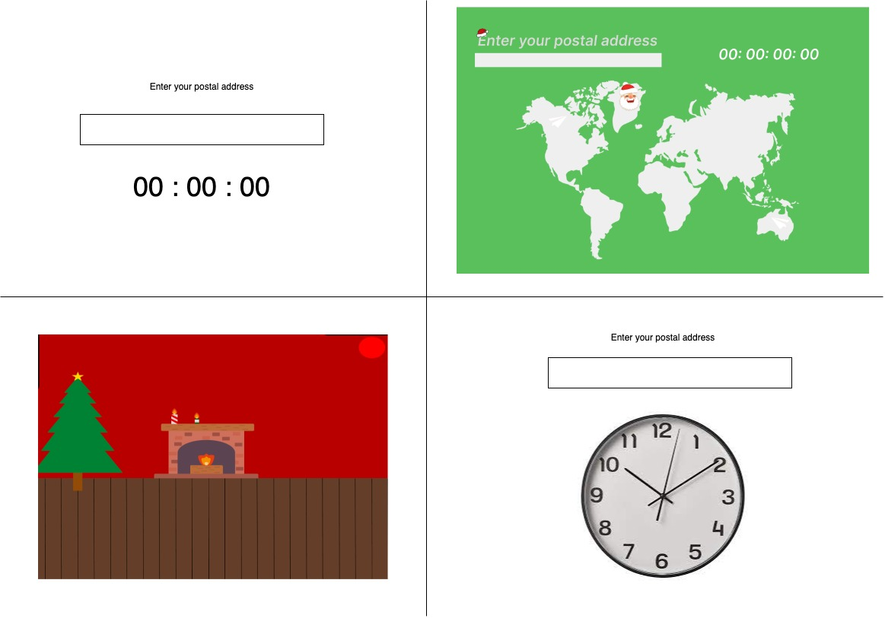
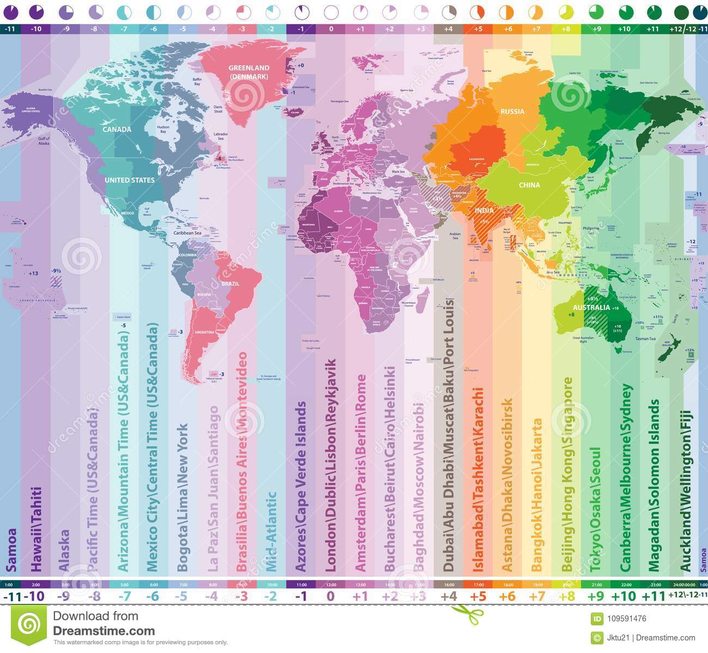

 santaclock.algosup.com 

 Functional Specification

 

 Clémentine Curel

 Last Updated: November 14, 2022

 

 – C O N F I D E N T I A L –

 ALGOSUP, Group 6. All Rights Reserved. 

# Summary

// doit etre retractable

 

# Overview

 

We have just entered the Christmas period, cities started to decorate their streets and children have started to make their gifts list for Santa Claus.

For the eager children out there, we want a website where all the children in the world can see exactly when Santa will come.

Multiple people have already created websites or applications that can do that, they just take your localisation and give you the countdown till Christmas.

We want something more precise but also not restricted to your position.

The idea begins with a countdown till midnight on the 24th of December. Provided that, the user only needs to write a postal address. Then, we will convert this address into geographic coordinates to know when it's midnight following the sun and not the clock.

The countdown will display the number of days, hours, minutes and seconds left before the precise time when the sun will be at the exact opposite of these coordinates on the 24th of December 2022.

We use the position of the sun instead of the clock because we assume that Santa travels at the speed of the sun.

The second objective of this project is to assure a peak load of the website at every time. We want to be sure that a maximum of children can go on this website at the same time.

The project is due on the 15th of December 2022.

This spec is not, by any stretch of the imagination, complete.

 

# Stackholders

- ALGOSUP
- Users

 

# Personas

 

 

# Scenarios

 

**Scenario 1: Mike.**

Mike is a child of 4 yo who is impatient about Christmas and receiving gifts. Especially the last fire truck toy. With all this impatience, his mother has given him her tablet so he can know when Santa will come. Her mom has heard about the website santaclock thanks to an ad on Facebook. 

Mike is worried about being alone on this website because he has difficulties in reading and writing. The biggest problem is not finding the place he wants.

 

**Scenario 2: Camille.**

From the height of her ten years, Camille wants to meet Santa Claus at all costs. To meet him, she has decided that this year, she will hide and wait patiently for his arrival. To not miss his arrival, she's hiding with her parents' tablet on the santaclock website and constantly refreshes it. 

 

**Scenario 3: Irène**

Irène is a mom of two kids who constantly asks her when Santa will arrive. To take some rest of those questions, she has decided to leave them on the santaclock website. 

As a protective mom, she wants to be sure her children are safe on this website. That is why she doesn't want to be asking for pieces of information or seeing ads.

 

**Scenario 4: Carl**

Carl is a computer science student who searching for a school. To find an interesting school he's going on multiple tradeshows. This is where he discovered ALGOSUP, some of their students have created the santaclock website. 

Seeing that a lot of people are on this website at the same time, Carl saw that it can handle peak load. 

 

# Non Goals

save the position / the input

good design

world's map

animations

list other dates

 

# santaclock.algosup.com Flowchart

???

 

# Design

ne pas ressembler à google

write what means the count down under

00 : 00 : 00 : 00

days   hours   minutes   seconds

## Mockups

 

 

Display the precise time when Santa clause will be at the user's location
- Put an input for the user to enter his postal adress and thus be able to have the most accurate prediction
- Display the location of Santa clause on a map
- Display the location of the reindeers on a map
- Responsive design
- The time will be displayed in a format like this (DD:HH:MM:SS)

" 00: 00: 00: 00 " precisely when the sun will be at the exact opposite of this coordinates.

what append at 00:00 ? 

errors pages

 

# Description of the functionalities

This will be a website because it needs to be fast, we don't want them to lose their time by downloading an application. Also, we will not have to get a google developer account which is chargeable.

Robust, elastic, can handle a peak load. several thousand requests

We will have a subdomain owned by ALGOSUP named santaclock.  

---

## Write the postal address
---

## no refresh nedded

First 00:00 at Greenwitch

you can't ask for the localisation

give your postal address and it will be converted into coordinates

Santa is travelling at the speed of the sun

depending on the position you will know when Santa will come

- the time will be the number of days, hours, minutes and seconds left (00: 00: 00: 00)

Receive a large number of people on the website at the same time

Security

- Don't save any data

 

# Risk and assumptions

low user/ customer satisfaction
unpredictable requirements changes
Team bad communication
No working software,  or until late
Too complex
Errors on calcul

late 
security?

 

# Glossary / Footnotes

countdown : DD:HH:MM:SS
date of santa : Between the 24th of december and the 25th of december at 00:00:00:00 
peak load : several thousands of request
postal address
geographic coordinates
speed of the sun
ALGOSUP

docker: Docker is a set of platform as a service products that use OS-level virtualization to deliver software in packages called containers.

Greenwich ?

 

