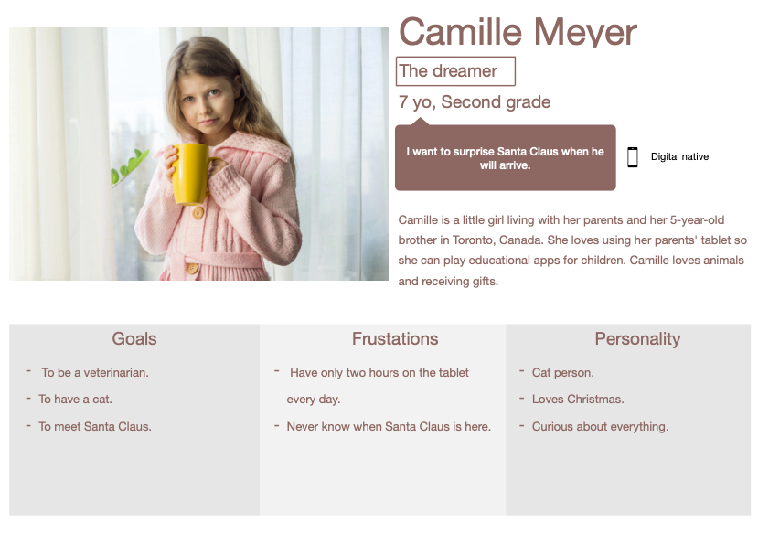
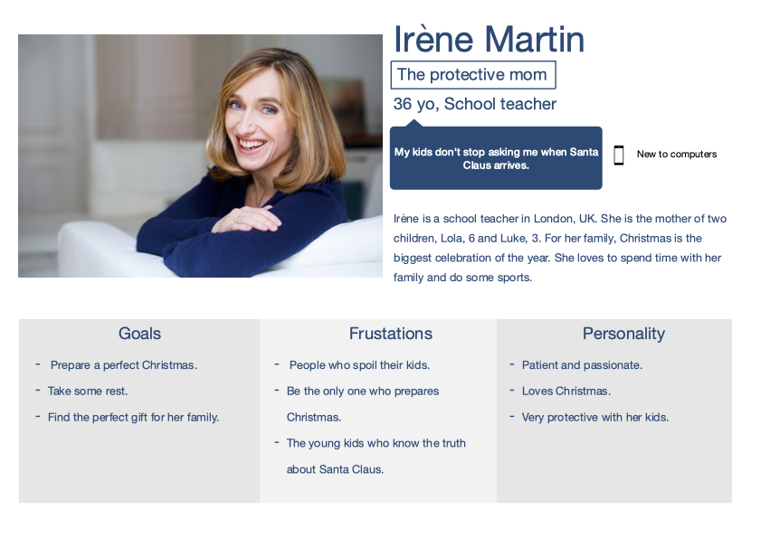

 santaclock.algosup.com 

 Functional Specification

 

 Clémentine Curel

 Last Updated: November 14, 2022

 

 – C O N F I D E N T I A L –

 ALGOSUP, Group 6. All Rights Reserved. 

# Summary

// doit etre retractable

 

# Overview

 

We have just entered the Christmas period, cities started to decorate their streets and children have started to make their gifts list for Santa Claus.

For the eager children out there, we want a website where all the children in the world can see exactly when Santa will come.

Multiple people have already created websites or applications that can do that, they just take your localisation and give you the countdown till Christmas.

We want something more precise but also not restricted to your position.

The idea begins with a countdown till midnight on the 24th of December. Provided that, the user only needs to write a postal address. Then, we will convert this address into geographic coordinates to know when it's midnight following the sun and not the clock.

The countdown will display the number of days, hours, minutes and seconds left before the precise time when the sun will be at the exact opposite of these coordinates on the 24th of December 2022.

We use the position of the sun instead of the clock because we assume that Santa travels at the speed of the sun.

The second objective of this project is to assure a peak load of the website at every time. We want to be sure that a maximum of children can go on this website at the same time.

The project is due on the 15th of December 2022.

This spec is not, by any stretch of the imagination, complete.

 

# Stackholders

- ALGOSUP
- Users

 

# Personas

 

 

# Scenarios

 

**Scenario 1: Mike.**

Mike is a child of 4 yo who is impatient about Christmas and receiving gifts. Especially the last fire truck toy. With all this impatience, his mother has given him her tablet so he can know when Santa will come. Her mom has heard about the website santaclock thanks to an ad on Facebook. 

Mike is worried about being alone on this website because he has difficulties in reading and writing. The biggest problem is not finding the place he wants.

 

**Scenario 2: Camille.**

From the height of her ten years, Camille wants to meet Santa Claus at all costs. To meet him, she has decided that this year, she will hide and wait patiently for his arrival. To not miss his arrival, she's hiding with her parents' tablet on the santaclock website and constantly refreshes it. 

 

**Scenario 3: Irène.**

Irène is a mom of two kids who constantly asks her when Santa will arrive. To take some rest of those questions, she has decided to leave them on the santaclock website. 

As a protective mom, she wants to be sure her children are safe on this website. That is why she doesn't want to be asking for pieces of information or seeing ads.

 

**Scenario 4: Carl.**

Carl is a computer science student who searching for a school. To find an interesting school he's going on multiple tradeshows. This is where he discovered ALGOSUP, some of their students have created the santaclock website. 

Seeing that a lot of people are on this website at the same time, Carl saw that it can handle peak load. 

 

# Non Goals

See with the client!

save the position / the input

good design

world's map

animations

list other dates

 

# Details

## Features

The project is a website because we need it to be fast. We don't want the users to lose their time by downloading an application. 

We will have a subdomain owned by ALGOSUP named santaclock.  

 

When the user arrives on the website, he's on the index.html page.
Here, he will get to know the page with the instructions for the address, the countdown and the map.

 

Now that he knows the principal features of the page, he will enter a postal address in the right place because it's indicated with a placeholder with what he has to write. 

 

When the user writes the wrong address or one with an error, the sentence "Are you sure you write an existing address?" will appear under the input.

 

When the user valid the address, the address will stay in the input. Therefore, it will be easier for the user to correct his error or to remember the address he writes.

 

The user will be able to press a button next to the input or to press the enter key to validate his address.

 

A Santa Claus head will be placed at the north pole when there is no address. Once there is a valid address, the Santa head will be at this one.

 

When the user writes the wrong HTTP address on the search bar, he will find an error 404 page.

 

We will not ask the user for his location. We also don't want any dependencies on anything. It means no Application Programming Interface (API).

 

We want you to find the position of the address by finding the geographical coordinates. 

 

## Design

 

The main audience of this website will be kids and their parents. So, this website has to be as much user-friendly as possible.

For the design, we want a Christmas spirit, and for that, we want to use these colours:
- Light green: #58BD59,
- White: #E9E9E9,
- Red: #E82923,

 

## Mockups
 

Add:
- Santa Claus will be there in "count down"
- Error 404 page

### index.html

 

 

 

### 404.html

 

 

First 00:00 at Greenwitch

you can't ask for the localisation

give your postal address and it will be converted into coordinates

Santa is travelling at the speed of the sun

depending on the position you will know when Santa will come

- the time will be the number of days, hours, minutes and seconds left (00: 00: 00: 00)

Receive a large number of people on the website at the same time

 

# Security

- Don't save any data
## For the user

## For us

 

# Risk and assumptions

low user/ customer satisfaction

unpredictable requirements changes

Team bad communication

No working software,  or until late

Too complex

Errors on calcul

late 
security?

 

# Glossary / Footnotes

countdown : DD:HH:MM:SS time left
date of santa : Between the 24th of december and the 25th of december at 00:00:00:00 
peak load : several thousands of request
postal address : country!
geographic coordinates
speed of the sun
ALGOSUP
placeholder
input 
page 404
API

docker: Docker is a set of platform as a service products that use OS-level virtualization to deliver software in packages called containers.

Greenwich ?

 

